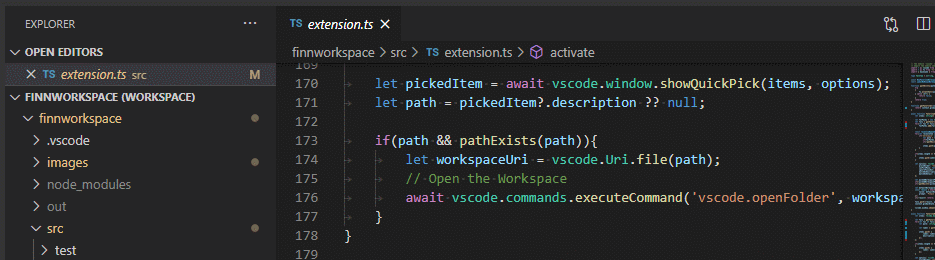

# Finn's Workspace List

Sublime style quick switch workspace, along with a little more workspace managements.

## Requirements

Visual Studio Code 1.50+

## Features

I really miss the `Ctrl + Alt + P` switching projects in sublime text, so I made this little extension.

Press the short cut or type the command in your command palette, then you can choose on workspace from the list to switch to.

> Command: `Finn's Workspace List: Quick Switch Workspace`

## Favorites

You can add workspaces from recent list to Favorites. Favorite workspaces will appear at the top of the quick switch list. You can give a name to the workspace so that you can quickly filter the list with the name to find the workspace later.

> Command: `Finn's Workspace List: Add to Favorites`  
> Command: `Finn's Workspace List: Remove from Favorites`

## Commands and Key Mappings

* `finnworkspace.quickSwitch` - Finn's Workspace List: Quick Switch Workspace
    * Popup a quick pick box to let the user choose one from the recent workspaces to switch to
    * Default Shortcut: `Ctrl + Alt + P / Ctrl + Cmd + P (MAC)`
* `finnworkspace.favoriteAdd` - Finn's Workspace List: Add to Favorites
    * Add workspace to Favorites
* `finnworkspace.favoriteRemove` Finn's Workspace List: Remove from Favorites
    * Remove workspace from Favorites

## Extension Settings

No settings currently.

## Known Issues

N/A

## Release Notes

### 1.0.0
* Initial release. Including quick switch and Favorites management.

### 0.9.1
* Supported oldest VSCode version pushed back to 1.50.X.
* Improve documentation.
* BUGFIX

### 0.9.0

Pre-release: test Marketplace publishing